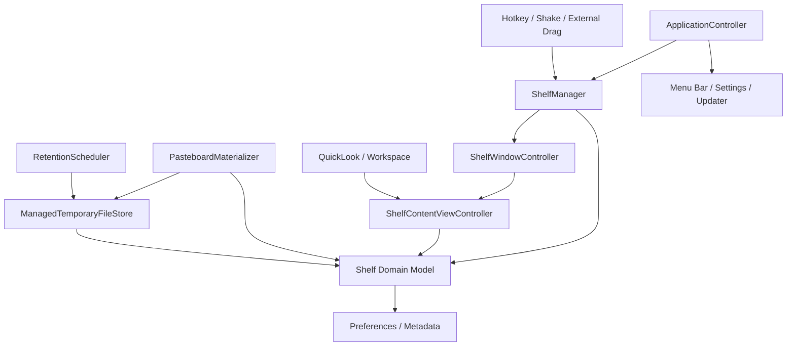
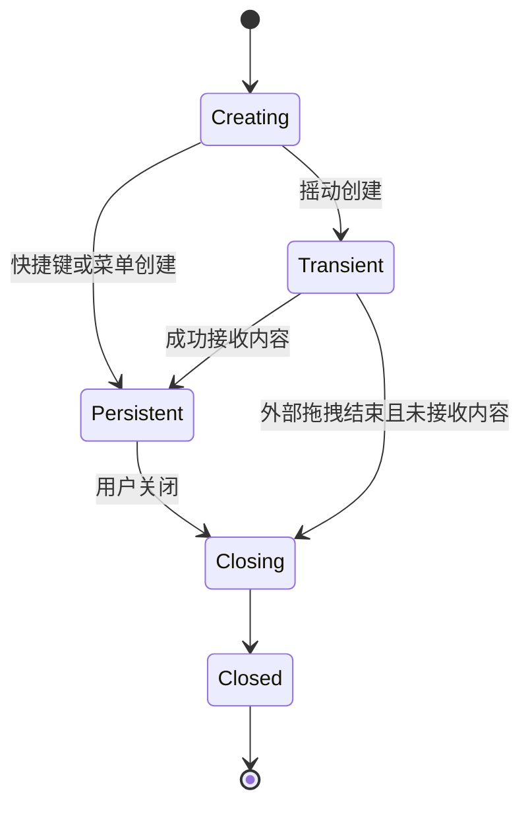

# Drops macOS 原生化重构方案

> 文档版本：V1.3<br>
> 制定日期：2026-07-13<br>
> 更新日期：2026-07-15<br>
> 需求基线：[Drops-PRD.md](../Drops-PRD.md)<br>
> 方案状态：产品范围已确认（不含图片/视频压缩）；阶段 0–3 已完成；当前为阶段 4 产品打磨；其后为阶段 5 发布准备<br>
> 开发进度：[development-progress.md](development-progress.md)<br>
> 阶段 0 审查：[stage-0-review-issues.md](stage-0-review-issues.md)<br>
> 阶段 1 审查：[stage-1-review-issues.md](stage-1-review-issues.md)

## 1. 结论

Drops 后续仅支持 macOS，并采用原生 Swift 完整重构。当前仓库新增独立的 `macos-native/Drops.xcodeproj`，作为唯一继续开发和发布的应用工程。

不在现有 Flutter macOS Runner 内逐步替换 UI，也不再维护 Windows 版本。现有 Flutter 代码只作为迁移时的行为和算法参考，不再承担新功能开发；完成必要资产迁移后，从正式构建和发布流程中移除。

推荐决策如下：

| 决策项 | 选择 |
|---|---|
| 需求依据 | 以 `docs/Drops-PRD.md` 和确认后的验收用例为准 |
| 工程位置 | 当前仓库新增 `macos-native/Drops.xcodeproj` |
| 产品平台 | 仅支持 macOS |
| macOS UI 技术 | AppKit 为核心，SwiftUI 为辅助 |
| 内容架窗口 | `NSPanel` / `NSWindow` + `NSWindowController` |
| 内容网格与列表 | 优先使用 `NSCollectionView` |
| 拖放与剪贴板 | AppKit `NSDraggingDestination`、`NSDraggingSource`、`NSPasteboard` |
| 设置和表单页面 | SwiftUI，可通过 `NSHostingController` 承载 |
| Flutter 依赖 | 原生 macOS App 不依赖 Flutter Engine 和 MethodChannel |

## 2. 重构原因

当前交互问题并非单一 Flutter 控件缺陷，而是多套生命周期共同控制同一交互导致的系统性复杂度：

- AppKit 管理窗口、焦点、系统拖放、透明区域和窗口动画。
- Flutter 管理内容视图、选择状态、界面动画和业务页面。
- 每个内容架使用独立 Flutter Engine，涉及引擎启动和插件注册时序。
- AppKit 与 Dart 之间通过 MethodChannel 传递事件和等待回调。
- 窗口大小变化与 Flutter 内容状态需要跨运行时同步。

这些边界已经导致启动延迟、拖入失效、动画丢失、窗口边缘异常、引擎崩溃和状态切换卡住等问题。继续修补可以解决单个故障，但难以从结构上降低类似问题再次发生的概率。

原生化后，窗口、拖放、动画、焦点和内容状态都由同一个 AppKit 事件循环驱动，可以显著缩短交互链路并降低时序不确定性。

原生化不能自动消除所有业务缺陷，因此仍需建立明确的状态模型和自动化验收，而不是直接按旧代码逐行翻译。

## 3. 产品基线与范围

### 3.1 需求优先级

新实现以 PRD 为产品事实来源，现有代码仅用于理解历史行为、复用成熟算法和对照结果。

PRD 第 8 章已经确认以下产品边界；另据 2026-07-14 产品决策，图片/视频压缩亦不进入原生首版：

- 不实现文件归档、媒体裁剪、音频提取、ICO 转换、视频下载和媒体下载。
- 不实现图片/视频压缩，以及压缩所需的格式转换、缩放、能力准备与任务调度。
- 不提供独立辅助工具入口。
- Drops 管理的临时文件默认保留 30 天，支持配置且最多保留 120 天。
- 混选本地内容和链接时，空格只预览本地内容。
- 首版完整支持英文和简体中文，并统一密码、加密和安全相关文案。

不应把旧实现中的偶然行为或架构限制直接固化为新需求。`docs/Drops-PRD.md` 中仍有图片/视频压缩描述时，以本方案与阶段 0 冻结清单为准，后续再同步 PRD。

### 3.2 第一阶段范围

第一阶段优先完成 PRD 5.1–5.5 的核心内容架体验：

- 快捷键、菜单栏和拖拽摇动创建内容架。
- 主动内容架与临时内容架的生命周期。
- 最多同时存在 20 个相互独立的内容架。
- 文件、文件夹、链接和剪贴板内容的加入与去重。
- 收起堆叠态、展开网格/列表态和窗口过渡动画。
- 单选、追加选择、范围选择、打开、定位和移除。
- 单项、多选和整堆拖出，以及复制/移动后的保留规则。
- Quick Look 和链接预览。
- 菜单合并与拖拽合并文本。

菜单栏、基本设置、日志和关于页应在第一阶段末具备最小可用版本，以便形成可以日常试用的应用。

### 3.3 后续范围

以下能力在核心交互稳定后迁移（均不含媒体压缩）：

- 临时文件保留设置、到期清理和手动清理（阶段 2 已落地基础能力，阶段 3 完善设置入口）。
- 完整设置、中英文、多语言基础设施、诊断导出和自动更新。

## 4. 目标架构

### 4.1 分层原则

原生版本按“领域状态、系统能力、界面呈现”分层：



约束：

- 每个内容架拥有独立 `Shelf` 模型，不共享全局内容和选择状态。
- `ShelfManager` 只管理内容架集合和生命周期，不直接绘制 UI。
- `ShelfWindowController` 只负责窗口位置、层级、焦点、大小和动画。
- `ShelfContentViewController` 负责内容展示和用户操作，不直接决定全局生命周期。
- 拖放和剪贴板服务输出标准化 `ShelfItem`，界面不直接解析 Pasteboard 类型。
- 临时文件必须进入应用专属的受管目录并持久化元数据，不能依赖可能被系统提前清除的通用临时目录。
- 所有界面文案从 String Catalog 读取，业务和视图代码不得硬编码用户可见字符串。
- 不引入媒体压缩或外部 CLI 媒体处理任务管线。

### 4.2 建议模块

```text
macos-native/
├── Drops.xcodeproj
├── Drops/
│   ├── Application/
│   │   ├── AppDelegate.swift
│   │   ├── ApplicationController.swift
│   │   └── MenuBarController.swift
│   ├── Domain/
│   │   ├── Shelf.swift
│   │   ├── ShelfItem.swift
│   │   ├── ShelfState.swift
│   │   ├── TemporaryFileRecord.swift
│   │   ├── RetentionPolicy.swift
│   │   └── SelectionModel.swift
│   ├── ShelfUI/
│   │   ├── ShelfWindowController.swift
│   │   ├── ShelfContentViewController.swift
│   │   ├── ShelfCollectionView.swift
│   │   └── ShelfItemView.swift
│   ├── Input/
│   │   ├── GlobalHotkeyManager.swift
│   │   ├── GlobalInputCoordinator.swift
│   │   └── ExternalDragCoordinator.swift
│   ├── Services/
│   │   ├── PasteboardMaterializer.swift
│   │   ├── DragService.swift
│   │   ├── PreviewService.swift
│   │   ├── ManagedTemporaryFileStore.swift
│   │   ├── RetentionScheduler.swift
│   │   └── SettingsService.swift
│   ├── SettingsUI/
│   ├── AboutUI/
│   └── Resources/
│       ├── Localizable.xcstrings
│       └── InfoPlist.xcstrings
├── DropsTests/
├── DropsUITests/
└── README.md
```

实际分组可以随工程演进调整，但领域模型不得反向依赖 AppKit 界面或旧 Flutter 代码。Flutter 代码不进入原生 App 的任何 Target。

## 5. AppKit 与 SwiftUI 的职责

不建议将内容架完全使用 SwiftUI 实现。Drops 的核心是非标准浮窗、系统拖放和精确鼠标交互，这些能力使用 AppKit 更直接、可预测。

### 5.1 使用 AppKit 的部分

- 内容架窗口、无边框样式、透明背景、圆角、阴影和窗口层级。
- 不抢焦点的临时窗口和可激活的主动窗口。
- 窗口出现、收起、展开、关闭动画。
- Finder 和其他应用之间的拖入、拖出。
- Pasteboard 数据识别与临时文件生成。
- 网格、列表、多选、范围选择和右键菜单。
- Quick Look、Finder 定位和默认应用打开。
- 菜单栏、全局快捷键和全局鼠标事件。

### 5.2 使用 SwiftUI 的部分

- 设置页面。
- 关于和许可证页面。
- 普通提示、进度和错误页面。

SwiftUI 页面通过 ViewModel 调用领域服务，不直接持有内容架窗口或全局事件监听器。

## 6. 状态模型

### 6.1 内容架模型

建议每个内容架至少包含：

```swift
struct ShelfID: Hashable, Codable, Sendable {
    let rawValue: UUID
}

final class Shelf {
    let id: ShelfID
    let source: ShelfOpenSource
    var lifecycle: ShelfLifecycle
    var presentation: ShelfPresentation
    var items: [ShelfItem]
    var selection: Set<ShelfItem.ID>
}
```

关键点：

- 内容顺序必须使用数组表达，不能使用 `Set` 承担排序职责。
- 去重通过单独索引完成，新加入的已有内容移动到数组前部。
- 选择集合保存稳定 ID，不保存易变化的列表位置。
- 窗口状态与内容状态分离，窗口动画不能阻塞领域状态提交。

### 6.2 生命周期



内容架的收起、展开、拖入高亮和任务进度属于展示状态，不应修改生命周期。

### 6.3 事件原则

- 先提交领域状态，再执行不影响正确性的动画。
- 动画完成回调不得成为内容状态切换的唯一触发条件。
- 系统拖放结束事件必须支持复制、移动、链接和取消。
- 重复或迟到的系统事件必须幂等处理。
- 内容架关闭后，所有迟到事件都应被忽略。

### 6.4 临时文件模型与保留策略

剪贴板文本、图片、富文本、PDF 等非文件内容必须写入 Drops 管理目录，例如：

```text
~/Library/Application Support/<bundle-id>/TemporaryContent/<UUID>/...
```

启用 App Sandbox 时，该路径自然位于应用容器内。不得使用 `NSTemporaryDirectory` 作为 30 天保留文件的最终存储位置，因为系统可以提前清理该目录。

每个受管临时文件至少记录：

```swift
struct TemporaryFileRecord: Codable, Sendable {
    let id: UUID
    let relativePath: String
    let createdAt: Date
    var expiresAt: Date
    var activeShelfReferences: Set<ShelfID>
    var deletionState: DeletionState
}
```

保留与清理规则：

- `RetentionPolicy.defaultDays` 为 30，用户配置必须是正整数且不得超过 120。
- `expiresAt` 按 `createdAt + retentionDays` 计算；修改配置后批量重算现有记录。
- 应用启动时执行一次清理，持续运行时每 24 小时再次检查。
- 已到期但 `activeShelfReferences` 非空的记录标记为等待删除，不立即删除文件。
- 引用解除后，如果文件已到期，则安排删除；未到期则继续保留到到期日。
- 手动清理需要二次确认，并与自动清理使用同一安全删除入口；它可以删除未到期但已无活跃引用的受管文件，仍有引用的文件必须跳过并反馈数量。
- 删除前必须校验标准化路径仍位于受管根目录，拒绝符号链接逃逸和根目录外路径。
- 删除失败时保留记录并重试，不把失败伪装成成功。
- 外部拖入的文件和文件夹只保存引用，不进入受管临时文件记录，任何清理任务都不得删除它们。

### 6.5 本地化与安全文案

- 使用 Xcode String Catalog（`.xcstrings`）维护用户可见文案。
- 开发语言使用英文，首版提供完整的 `en` 与 `zh-Hans` 翻译。
- 默认根据 macOS 首选语言选择；不支持的语言回退英文。
- 设置页允许用户选择“跟随系统”“English”或“简体中文”。
- 菜单栏、快捷菜单、错误、确认弹窗、VoiceOver 标签和通知文案都必须本地化。
- 密码、加密、安全等级和兼容性文案使用统一术语表，并通过产品评审；不得暗示未实现的加密能力。

## 7. 现有资产处理

### 7.1 建议迁移或复用

| 现有资产 | 处理方式 |
|---|---|
| `Drops-PRD.md` | 作为需求和验收基线，评审后持续维护 |
| `ShelfLifecycleStore` | 迁移纯 Swift 生命周期规则及测试 |
| `GlobalHotkeyManager` | 迁移并补充快捷键冲突、禁用和恢复测试 |
| `GlobalInputCoordinator` | 迁移摇动算法，隔离为可测试的检测器 |
| `DropTarget` Pasteboard 解析 | 拆成无 Flutter 依赖的 `PasteboardMaterializer` |
| Quick Look 实现 | 迁移为 `PreviewService` |
| 菜单栏和 AppHost 逻辑 | 按新 Application 层重新接入 |
| 图标、图片和文案资源 | 校对后复用 |
| Bundle、签名、权限、Sparkle 配置 | 切换发布入口时迁移 |

所有复用代码都需要先移除 Flutter 类型、MethodChannel 和全局单例状态依赖。图片/视频压缩相关 Dart 代码、CLI 参数与工具链不迁移。

### 7.2 建议重写

- `WindowRuntime` 及全部 Flutter MethodChannel 窗口协调逻辑。
- 多 Flutter Engine 启动、注册和销毁逻辑。
- Flutter 内容架 UI 和跨运行时动画状态机。
- Flutter 拖放目标与原生覆盖层组合。
- Dart 全局 `items`、`selectedItems` 和 `appMode` 状态。
- 与 Flutter 插件绑定的右键菜单、Tooltip、Dropdown 和窗口控制。

旧实现可以用于对照，不应整段复制到新工程中。

### 7.3 不迁移的文件处理能力

以下能力已移出原生首版范围，相关 Dart 代码、外部工具参数和 UI 入口均不迁移：

- 图片/视频压缩、格式转换、缩放与视频转 GIF。
- 处理能力检查与首次准备流程。
- 归档、裁剪、音频提取、ICO 转换和媒体下载。

## 8. 实施阶段

各阶段的目标、范围、交付物和验收标准已拆分为独立实施文档。本章只保留总体顺序和阶段出口索引。

| 阶段 | 核心目标 | 阶段出口目标（不代表当前已通过） | 实施文档 |
|---|---|---|---|
| 阶段 0 | 冻结产品范围，验证决定架构成败的 macOS 系统能力 | 原生工程和关键技术验证通过，无架构阻断项 | [需求冻结与技术验证](stage-0-requirements-and-validation.md) |
| 阶段 1 | 建立内容架领域规则和稳定的多窗口骨架 | 多个内容架可独立创建、切换状态和关闭 | [内容架领域与窗口骨架](stage-1-shelf-domain-and-window.md) |
| 阶段 2 | 打通拖入、剪贴板、拖出和临时文件安全管理闭环 | 基础拖放与粘贴场景通过，清理不触碰原始文件 | [拖放与剪贴板主链路](stage-2-drag-drop-and-pasteboard.md) |
| 阶段 3 | 补齐符合 macOS 习惯的完整日常交互 | 核心内容架可连续日常使用，无阻断性交互问题 | [原生交互完善](stage-3-native-interactions.md) |
| 阶段 4 | 基于试用反馈持续打磨体验与正确性 | 需求池收敛，产品确认可封版 | [产品打磨](stage-4-product-polish.md) |
| 阶段 5 | 完成回归、性能、迁移和发布收口 | 原生版本满足发布清单，正式流程只产出 macOS 应用 | [发布准备](stage-5-release-readiness.md) |

阶段 0 至阶段 5 原则上顺序实施。下一阶段只有在上一阶段退出条件全部满足后才能进入；进入后仍需持续回归之前阶段的验收标准。阶段 4 用需求池滚动收集与实现打磨项，不得扩大已排除的功能边界；阶段 5 起功能冻结。已明确排除的功能边界（含图片/视频压缩）适用于所有阶段，不得以迁移、兼容或技术预留名义重新引入。

## 9. 测试与验收

### 9.1 自动化测试

领域单元测试至少覆盖：

- 主动与摇动创建的不同生命周期。
- 同一拖拽会话只能创建一个摇动内容架。
- 第 20 个内容架允许创建，第 21 个被拒绝。
- 接收内容后临时内容架晋升为持久状态。
- 拖拽结束后仅关闭未接收内容的临时内容架。
- 内容去重、前移、排序和选择稳定性。
- 复制、移动和取消后的内容保留规则。
- 关闭后忽略迟到事件。
- 文本合并顺序和结果替换规则。
- 混合选择本地内容与链接时只预览本地内容。
- 临时文件默认保留 30 天，配置值不能超过 120 天。
- 临时文件保留天数只接受正整数，非法输入不得覆盖上一次有效设置。
- 修改保留天数后按创建时间重算已有记录的到期时间。
- 已到期但仍被内容架引用的临时文件不会被删除。
- 自动清理在引用解除后仅删除已到期的受管临时文件。
- 手动立即清理可以删除未到期但无活跃引用的受管文件，且准确反馈跳过数量。
- 不支持的系统语言回退英文，手动语言选择覆盖系统语言。

系统服务测试至少覆盖：

- Pasteboard 各种数据类型的识别和临时文件命名。
- 同名临时文件防覆盖。
- 受管目录边界校验、符号链接逃逸防护和删除失败重试。
- 自动和手动清理均不删除外部拖入的原始文件。
- 多文件、文件夹、URL 的拖入和拖出。
- Quick Look 和 Finder 定位的输入过滤。

### 9.2 手工验收

以 PRD 第 9 章中仍在范围内的场景（9.1、9.2、9.4、9.5）为主验收清单，并补充：

- 多显示器、不同缩放比例和屏幕边缘创建。
- Finder、浏览器、邮件、聊天工具和 IDE 之间互相拖放。
- 外部拖拽过程中窗口出现但不抢焦点。
- 快速重复展开、收起、创建和关闭。
- 20 个内容架同时存在时的交互和资源占用。
- 深色/浅色模式切换。
- 英文、简体中文和不支持语言环境下的完整文案与布局。
- 保留天数设置、到期清理、活跃引用保护和手动清理二次确认。
- 密码、加密或安全文案不暗示未实现的产品能力。
- 睡眠唤醒、显示器插拔和应用重新激活。
- 无障碍、键盘操作和 VoiceOver 基础检查。

### 9.3 建议性能指标

以下指标需要在阶段 0 确认最终目标，建议先作为工程基准：

- 主动创建内容架到首帧可见：P95 小于 300 ms。
- 摇动触发到窗口可接收拖放：P95 小于 200 ms。
- 收起/展开动画保持连续，不依赖异步任务完成。
- 空内容架不启动无关重任务。
- 20 个空内容架同时存在时不产生持续高 CPU 占用。

## 10. 单一原生工程与发布策略

### 10.1 唯一实现

`macos-native/Drops.xcodeproj` 是唯一继续开发的产品工程。所有新增功能、缺陷修复、测试和发布配置都进入该工程。

现有 Flutter 代码冻结，只允许在迁移过程中读取和提取可复用的产品规则、算法与资源。不得继续在 Flutter 版本上实现产品功能，也不得让原生工程依赖 Flutter 运行时。媒体压缩相关代码与外部工具不迁移。

### 10.2 平台范围

Drops 仅支持 macOS：

- 不生成或发布 Windows 安装包。
- 不验收 Windows 功能和兼容性。
- 不为跨平台共享 UI 而引入 Flutter 或其他跨平台运行时。
- PRD、测试计划和发布文档均只描述 macOS 行为。
- 完成所需迁移后，清理仅服务于 Windows 的代码、依赖和构建配置。

### 10.3 发布条件

只有满足以下条件后才发布原生版本：

- 范围内的 PRD 核心验收场景（9.1、9.2、9.4、9.5）全部通过。
- 原生版本连续日常试用期间不存在阻断性窗口或拖放问题。
- 设置、快捷键和更新配置完成迁移验证。
- 仓库构建和发布流程不再依赖 Flutter 与 Windows 工具链。

## 11. 主要风险与控制措施

| 风险 | 控制措施 |
|---|---|
| 重写范围过大导致长期不可用 | 先交付内容架核心交互，再做发布收口；不并行迁移媒体压缩 |
| 把旧实现缺陷复制到新版本 | 冻结清单与验收用例优先，旧代码只作参考 |
| 全 SwiftUI 再次遇到拖放和窗口限制 | AppKit 承担核心窗口和拖放，SwiftUI 仅用于普通页面 |
| 一次性移除旧工程导致参考能力丢失 | 先迁移规则与资源，再从构建流程与仓库中清理旧代码 |
| 发布配置迁移影响现有用户 | 单独验证 Bundle ID、签名、设置迁移和 Sparkle 更新链路 |
| 临时文件泄漏或误删原文件 | 受管 Application Support 目录、来源标记、活跃引用、路径边界校验和清理测试 |
| 中英文文案遗漏或语义不一致 | String Catalog 完整性检查、术语表和双语验收 |
| 全局事件权限或系统版本差异 | 阶段 0 在最低支持系统和无额外权限环境验证 |

## 12. 下一步

1. ~~依据 PRD 第 8 章冻结 V1 功能清单~~ → [stage-0-requirements-and-validation.md](stage-0-requirements-and-validation.md) 第 4 节
2. ~~把 PRD 第 9 章改写为可执行验收清单~~ → 见阶段 0 文档第 4.3 节
3. ~~创建 `macos-native/Drops.xcodeproj`、测试 Target 和产品 Bundle ID 配置~~ → 已完成
4. 建立 `en`、`zh-Hans` String Catalog 和安全术语表（阶段 1/3）
5. ~~修复阶段 0 审查问题并完成浮窗/拖放/性能验证~~ → 见 [stage-0-requirements-and-validation.md](stage-0-requirements-and-validation.md) 第 11 节
6. 进入内容架领域模型和 MVP 实现 → [stage-1-shelf-domain-and-window.md](stage-1-shelf-domain-and-window.md)
