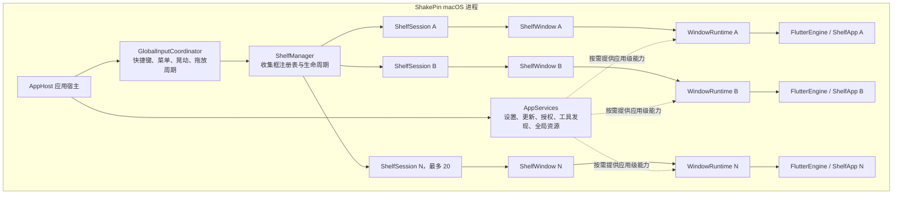
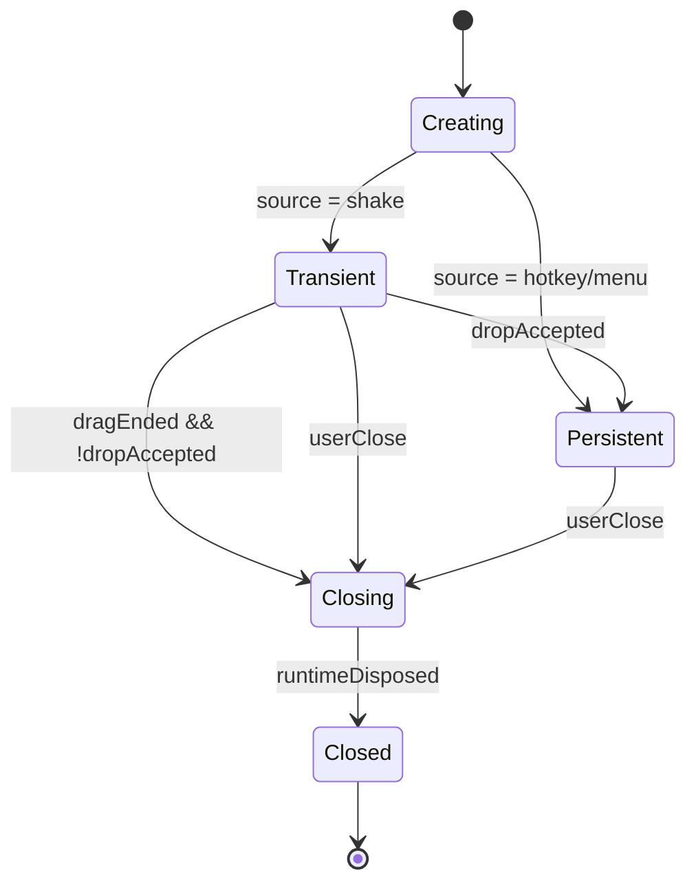
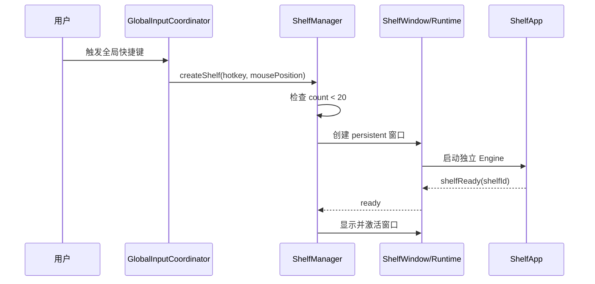
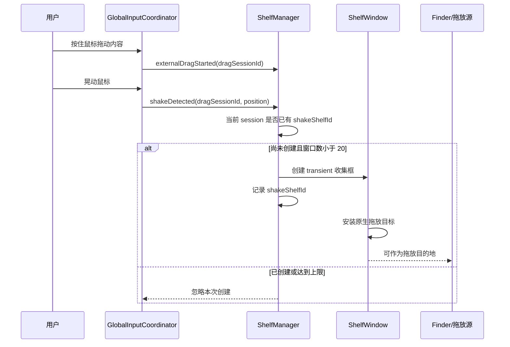
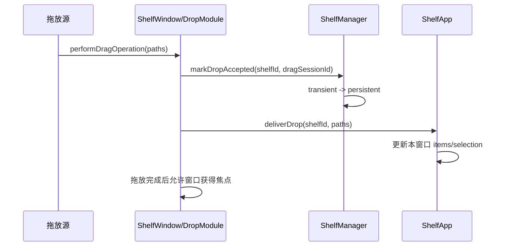
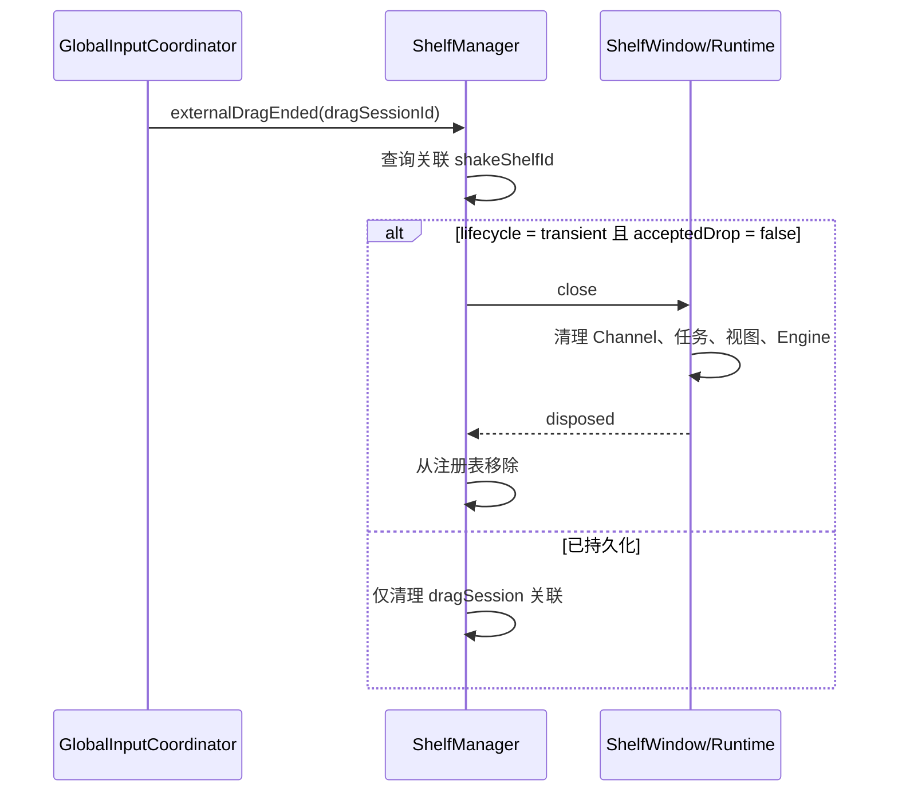

# ShakePin 多收集框架构重构与实现方案

> 文档状态：已实施（macOS 多收集框）  
> 适用平台：第一阶段以 macOS 为主  
> 目标基线：`dev` 分支  
> 参考分支：`mulit`、`multi-window`（仅用于复盘，不作为继续开发基线）

## 1. 背景

ShakePin 当前采用单主窗口设计。快捷键、菜单栏和晃动鼠标最终都会唤起或复用同一个收集框，同时所有文件列表、选择状态、功能模式、窗口显示状态和原生通道也围绕这个唯一窗口组织。

现有行为无法满足以下使用场景：

- 用户需要同时创建多个收集框，分别收集不同类型或不同用途的内容。
- 快捷键和菜单栏打开的收集框应当长期保留，直到用户主动关闭。
- 晃动鼠标产生的临时收集框，在未接收到内容时应自动关闭；成功接收内容后应转为长期保留。
- 同一次鼠标拖放过程中，即使连续触发多次晃动，也只能创建一个临时收集框。
- 所有收集框相互独立，不能出现状态串窗、拖放错窗、窗口互相隐藏、处理进度互相覆盖等问题。

`mulit` 和 `multi-window` 分支已经验证：直接在现有单窗口结构旁边复制一套窗口实现，会造成大量原生桥接代码重复、功能能力不一致、拖放时序错误、Flutter Engine 生命周期问题以及既有交互回归。

因此，本方案不再以“给单窗口逻辑增加若干判断”为目标，而是重新定义应用宿主、收集框、窗口运行时和业务状态之间的边界。

## 2. 建设目标

### 2.1 功能目标

1. 快捷键每触发一次，新建一个独立收集框。
2. 菜单栏手动打开每触发一次，新建一个独立收集框。
3. 手动创建的空收集框保持显示，直到用户主动关闭。
4. 晃动鼠标时，在当前拖放周期内最多创建一个临时收集框。
5. 晃动创建的收集框如果没有成功接收任何内容，在拖放结束后自动关闭。
6. 晃动创建的收集框一旦成功接收内容，立即转为持久收集框，之后只能由用户主动关闭。
7. 同时存在的收集框数量最多为 20 个。
8. 每个收集框拥有独立的文件、选择项、功能模式、处理进度和窗口状态。
9. 不影响现有收集、拖入、拖出、粘贴、展开、压缩、归档、媒体处理、Quick Look 等主要能力。

### 2.2 架构目标

- 将“应用级能力”和“窗口级能力”彻底分离。
- 将窗口生命周期从 Flutter 页面状态中剥离，由明确的窗口管理模型负责。
- 所有跨 Flutter/原生事件都能定位到唯一收集框，禁止无目标广播。
- 主窗口和收集框共用同一份窗口运行能力，不再复制完整的 MethodChannel 处理代码。
- 支持逐步迁移，重构过程中保持 `dev` 原有功能可运行。
- 为后续增加恢复窗口、窗口分组、关闭全部、跨窗口移动文件等能力预留模型空间。

### 2.3 非目标

第一阶段不包含：

- Windows 多窗口实现。
- 应用重写为纯 Swift、SwiftUI 或其他编程语言。
- 跨设备同步收集框。
- 应用重启后自动恢复全部收集框。
- 多收集框之间直接拖动并迁移业务任务状态。
- 20 个窗口同时执行重型媒体任务的无限并发能力。
- 对现有 UI 进行整体视觉重做。

## 3. 总体结论

本次工作属于“窗口基础设施中大型重构”，不是全项目重做。

保留 Flutter/Dart 作为现有 UI 和业务功能的主要实现，保留 Swift/AppKit 负责 macOS 窗口、全局输入监听和原生拖放。macOS 下采用“一个隐藏应用宿主 + 多个独立收集框窗口”的结构。

每个收集框由独立 Flutter Engine 和 Dart isolate 承载，使当前大量顶层 Dart 状态在不同收集框之间天然隔离；同时将原生侧重复的窗口能力抽取为统一的窗口运行时，避免每增加一种窗口就复制一遍原生通道实现。

## 4. 重构后总体架构



### 4.1 AppHost：应用宿主

应用宿主代表 ShakePin 进程本身，不再代表某一个收集框。

职责：

- 完成应用启动和退出。
- 初始化全局菜单栏图标。
- 初始化全局快捷键。
- 初始化晃动检测和外部拖放周期监听。
- 管理设置窗口、About、升级检查等应用级界面或能力。
- 初始化 `ShelfManager` 和应用级共享服务。
- 在没有收集框时继续保持应用运行。

宿主窗口可以是隐藏窗口或无业务内容的 Flutter 宿主，但不得再同时作为“特殊的第一个收集框”。所有收集框必须统一由 `ShelfManager` 创建，避免第一扇窗口和后续窗口走两套逻辑。

### 4.2 GlobalInputCoordinator：全局输入协调器

负责把操作系统级输入转换为明确的领域事件。

职责：

- 接收全局快捷键事件。
- 接收菜单栏创建、关闭等事件。
- 检测鼠标拖放开始、移动、晃动和结束。
- 为每次外部拖放生成唯一的 `dragSessionId`。
- 确保同一拖放周期最多发出一次“创建晃动收集框”请求。
- 不直接操作具体窗口，不直接向所有 Flutter Engine 广播事件。

输出事件示例：

- `manualShelfRequested(source: hotkey, position)`
- `manualShelfRequested(source: menu, position)`
- `externalDragStarted(dragSessionId)`
- `shakeDetected(dragSessionId, position)`
- `externalDragEnded(dragSessionId)`

### 4.3 ShelfManager：收集框管理器

`ShelfManager` 是所有收集框生命周期的唯一管理者。

职责：

- 维护当前存活的 `ShelfSession` 注册表。
- 强制执行最多 20 个收集框的限制。
- 创建手动或晃动来源的收集框。
- 维护当前拖放周期关联的临时收集框。
- 根据拖放是否成功决定临时收集框关闭或持久化。
- 处理关闭单个窗口、关闭当前窗口、关闭全部窗口等请求。
- 负责窗口销毁和 Flutter Engine 安全释放。
- 提供当前窗口数量和窗口查询能力。

`ShelfManager` 不负责文件处理业务，也不直接维护 Flutter 页面状态。

### 4.4 ShelfSession：收集框会话

每个可见收集框对应一个 `ShelfSession`。

建议模型：

```text
ShelfSession
  id: ShelfId
  source: ShelfOpenSource
  lifecycle: ShelfLifecycle
  windowState: ShelfWindowState
  associatedDragSessionId: DragSessionId?
  acceptedDrop: Bool
  createdAt: DateTime
  window: ShelfWindow
  runtime: WindowRuntime
```

其中：

```text
ShelfOpenSource
  hotkey
  menu
  shake

ShelfLifecycle
  transient      晃动产生，尚未接收内容
  persistent     手动产生，或晃动框已成功接收内容
  closing
  closed

ShelfWindowState
  creating
  ready
  visible
  hidden
  closing
  disposed
```

关键约束：

- `hotkey` 和 `menu` 创建后直接进入 `persistent`。
- `shake` 创建后进入 `transient`。
- `transient` 只能通过成功接收拖放转为 `persistent`。
- `transient` 在关联拖放周期结束且没有成功接收内容时关闭。
- `closed` 状态不可恢复，不允许继续接收事件。
- 生命周期转换必须由 `ShelfManager` 执行。

### 4.5 ShelfWindow：原生收集框窗口

`ShelfWindow` 是轻量的 AppKit 窗口对象。

职责：

- 管理窗口位置、尺寸、层级、圆角、透明背景和焦点。
- 挂载一个 Flutter View。
- 挂载窗口级原生拖放目标。
- 把原生拖放结果交给自己的 `WindowRuntime`。
- 转发关闭、粘贴、拖出等窗口级操作。

`ShelfWindow` 不应该：

- 注册全局快捷键。
- 创建菜单栏图标。
- 检测全局鼠标晃动。
- 维护其他收集框。
- 包含完整的业务处理逻辑。
- 复制 `MainFlutterWindow` 的全部代码。

### 4.6 WindowRuntime：窗口运行时

`WindowRuntime` 是本次重构最重要的复用边界。主窗口或任何收集框所需的窗口级原生能力，都通过同一套运行时注册和路由。

职责：

- 持有 `shelfId`、Flutter Engine、binary messenger 和窗口引用。
- 注册窗口级 MethodChannel。
- 管理该窗口的 DropTarget、DragSource、下拉菜单、Tooltip、文件图标缓存。
- 提供窗口尺寸、位置、显示、焦点等操作。
- 提供粘贴、拖入、拖出、Quick Look 等能力。
- 管理该窗口发起的原生进程任务及其回调。
- 在窗口关闭时统一清理 Channel、视图、任务和 Engine。

运行时必须使用组合而不是继承复制。宿主和 ShelfWindow 可以按能力安装不同模块，例如：

```text
WindowRuntime
  WindowChannelModule
  DropModule
  DragSourceModule
  ProcessModule
  PasteboardModule
  QuickLookModule
  NativeDropdownModule
  TooltipModule
  SettingsProxyModule
```

这样可以保证某项功能修复只修改一个模块，不需要同时维护主窗口版和收集框版。

### 4.7 ShelfApp：收集框 Flutter 入口

收集框使用独立于主应用宿主的 Flutter 入口。

职责：

- 读取并保存本收集框的 `shelfId` 和打开来源。
- 初始化收集框实际需要的 Dart 服务。
- 构建现有 `MainDropApp` 或其重构后的收集框页面。
- 向原生报告 `ready`。
- 接收只属于本窗口的拖放、粘贴和任务回调。
- 用户点击关闭时请求关闭当前 `shelfId`。

禁止两种做法：

- Secondary Engine 直接执行完整主应用 `main()`，导致菜单栏、升级、工具发现等全局服务重复初始化。
- Secondary Engine 只初始化极少量对象，导致进入压缩、归档等模式后访问未初始化服务。

应定义明确的 `ShelfBootstrap`，一次性完成该窗口完整且受控的初始化。

## 5. 领域模型

### 5.1 ShelfId

每个收集框创建时生成唯一 ID，在窗口关闭前保持不变。

用途：

- 原生窗口注册。
- Flutter Engine 命名。
- 跨语言消息路由。
- 日志关联。
- 任务和资源清理。

任何窗口级调用都必须能从当前 binary messenger 或参数上下文确定 `shelfId`，不能依赖“当前第一个窗口”或“当前唯一窗口”。

### 5.2 DragSession

```text
DragSession
  id: DragSessionId
  state: idle | dragging | finishing | finished
  shakeShelfId: ShelfId?
  startedAt: DateTime
```

约束：

- 每次鼠标按下并确认存在外部拖放内容后开始一个拖放周期。
- 一个 `DragSession` 最多关联一个 `shakeShelfId`。
- 连续晃动只更新检测数据，不继续创建窗口。
- 鼠标松开或拖放取消后结束该周期。
- 新拖放周期不能继承上一次的 `shakeShelfId`。

### 5.3 ShelfState：Flutter 窗口内业务状态

建议逐步把当前散落的顶层状态收拢为窗口级状态模型：

```text
ShelfState
  items
  selectedItems
  appMode
  detailExpanded
  outputDirectory
  archiveState
  minifyState
  cropState
  processingTasks
  errorState
```

第一阶段由于每个窗口拥有独立 Dart isolate，现有顶层变量不会跨窗口共享，因此不要求一次性完成所有状态容器化。但应停止新增窗口相关的顶层全局布尔变量，并逐步将状态集中到 `ShelfState`/`ShelfController`，以便测试生命周期和未来支持状态恢复。

应用级状态必须与 `ShelfState` 分开，例如：

- 用户设置。
- 授权状态。
- 应用版本和更新状态。
- CLI 工具安装状态。
- 菜单栏图标状态。

## 6. 生命周期状态机

### 6.1 收集框状态转换



### 6.2 必须遵守的生命周期规则

1. Flutter 的 `items.isEmpty` 不能作为判断拖放是否成功的唯一依据。
2. 拖放成功以原生目标真正接受并执行 `performDragOperation` 为准。
3. `dropAccepted` 必须先于拖放周期的最终关闭判断写入会话。
4. 鼠标松开和 AppKit 拖放回调可能存在时序差异，结束流程必须归一到 `ShelfManager`，不能由 Flutter 和原生分别关闭。
5. 窗口一旦进入 `closing`，后续拖放、任务回调和 UI 消息应被忽略或安全结束。
6. Engine 销毁前必须取消窗口任务、解绑 Channel 和移除原生视图。

## 7. 核心流程

### 7.1 快捷键创建收集框



规则：

- 每次快捷键都尝试创建新窗口，不复用旧窗口。
- 新窗口为空时持续显示。
- 达到 20 个时拒绝创建，不关闭、不替换、不移动已有窗口。
- 达到上限后的用户反馈可先使用系统提示音或日志，后续再增加 Toast。

### 7.2 菜单栏创建收集框

流程与快捷键一致，`source` 为 `menu`。

菜单事件直接交给 `ShelfManager`，不再发送给某个旧 Flutter 页面后调用全局 `showApp()`。

### 7.3 晃动创建临时收集框



关键点：

- 晃动框创建时不能强制激活应用，否则可能打断 Finder 持有的拖放源。
- 原生拖放目标必须尽早安装，不能等待 Flutter 第一帧后才允许接收内容。
- Flutter 尚未 ready 时接收到的路径由 `WindowRuntime` 暂存，ready 后再定向投递。

### 7.4 晃动框成功接收内容



规则：

- 先持久化会话，再投递给 Flutter，避免 Flutter 构建或消息延迟导致窗口被误关。
- 文件投递只能进入目标窗口对应的 binary messenger。
- 成功接收后，该窗口与原拖放周期解绑，之后不会因为拖放结束自动关闭。

### 7.5 晃动框未接收内容



### 7.6 手动关闭收集框

用户在任意收集框点击关闭：

1. Flutter 向当前窗口运行时发送 `closeSelf`。
2. 运行时根据自身上下文得到 `shelfId`。
3. `ShelfManager` 将会话置为 `closing`。
4. 取消或安全结束属于该窗口的任务。
5. 解绑所有 MethodChannel handler。
6. 移除原生 DropTarget、DragSource 和辅助视图。
7. 从窗口移除 Flutter ViewController。
8. 安全关闭 Flutter Engine。
9. 关闭窗口并从注册表移除会话。

任何 Flutter 页面不得直接关闭其他窗口，也不得调用全局单例隐藏操作。

### 7.7 粘贴和拖出

粘贴：

- 由当前 key window 接收 `Cmd+V`。
- 从系统剪贴板提取内容后，只投递给该窗口。
- 如果当前焦点在原生文本输入框中，保持系统默认粘贴行为。

拖出：

- 由当前窗口的 `DragSourceModule` 创建原生拖放会话。
- 拖放完成结果只回传给发起窗口。
- 一个窗口拖出失败不得影响其他窗口的选择或 UI 状态。

### 7.8 文件处理任务

压缩、归档和媒体处理任务属于发起它们的收集框。

```text
ShelfId
  └── TaskRegistry
        ├── Task A
        ├── Task B
        └── ProcessHandler
```

要求：

- 任务输出和错误回调带有窗口上下文。
- 关闭窗口时必须有明确策略：取消任务，或转交应用级后台任务管理器。
- 第一阶段建议关闭窗口即提示并取消该窗口仍在执行的任务，避免无 UI 的孤儿任务。
- 应用级可以设置重型任务并发上限，防止 20 个窗口同时启动高负载处理。

## 8. 原生与 Flutter 通信边界

### 8.1 通道分类

建议把通道按作用域分为两类。

应用级通道：

- 设置。
- 菜单栏。
- 全局快捷键配置。
- 应用版本和更新。
- 授权。
- 工具可用性。

窗口级通道：

- 窗口尺寸和位置。
- 显示、焦点和关闭当前窗口。
- 文件拖入和拖出。
- 粘贴板。
- Quick Look。
- 原生下拉菜单和 Tooltip。
- 进程任务及其输出。

### 8.2 路由原则

- 每个 Flutter Engine 使用自己的 binary messenger，因此同名窗口通道也必须绑定到对应 Engine。
- 窗口事件默认不携带“寻找当前窗口”的隐式逻辑，运行时已经知道自己的 `shelfId`。
- 宿主收到的全局事件先进入 `ShelfManager`，再由 Manager 选择目标窗口。
- 禁止遍历所有 Engine 广播 `dragPerform`、`pastePerform`、任务输出等定向事件。
- 允许广播的事件必须是明确的应用级只读事件，例如主题或设置变化。

### 8.3 启动握手

每个新窗口建立如下握手：

```text
Native create runtime
  -> install native drop destination
  -> start Flutter Engine
  -> ShelfBootstrap initializes Dart dependencies
  -> Flutter sends shelfReady(shelfId)
  -> Runtime flushes queued events
  -> ShelfSession enters ready/visible
```

启动过程中收到的拖放内容必须按顺序缓存在当前运行时，不能丢失，也不能发给宿主 Engine。

## 9. 保留范围

以下部分原则上保留，只做必要的依赖注入或作用域适配：

### 9.1 Flutter UI

- 收集框主体布局。
- 文件缩略图、文件列表和选择交互。
- 展开和收起形态。
- 模式侧边栏。
- 压缩、归档和其他工具页面。
- 当前视觉风格、圆角、动画目标和操作习惯。

### 9.2 业务能力

- 文件类型识别。
- 文本合并。
- 图片/视频压缩逻辑。
- 归档和解压相关逻辑。
- 音频提取、格式转换、下载等 CLI 封装。
- Quick Look 的业务入口。
- 文件图标和缩略图展示逻辑。

### 9.3 应用级能力

- 设置数据和设置窗口。
- 自动更新。
- 授权能力。
- 菜单栏图标和现有菜单内容。
- 全局快捷键配置。
- 日志和分析能力，但日志需要增加 `shelfId` 上下文。

### 9.4 平台策略

- macOS 继续使用 Swift/AppKit。
- Flutter/Dart 继续作为跨平台 UI 和主要业务层。
- Windows 第一阶段保持原有单窗口行为。

## 10. 必须重构的范围

### 10.1 MainFlutterWindow

需要拆分其当前混合职责：

- 应用宿主能力移到 `AppHost`。
- 全局输入监听移到 `GlobalInputCoordinator`。
- 窗口级 Channel 和拖放能力移到 `WindowRuntime` 模块。
- 设置和菜单栏保留在应用级宿主。
- 进程执行变为窗口级任务能力或应用级任务服务。

重构后 `MainFlutterWindow` 不再是所有能力的唯一容器。

### 10.2 窗口显示和隐藏 API

以下单窗口语义需要退出收集框主流程：

- 全局 `showApp()`。
- 全局 `hideApp()`。
- 全局 `resetFrameAndHide()`。
- 通过“当前窗口是否可见”决定是否复用。
- 通过 `NSApp.windows.first` 查找业务窗口。

替换为：

- `ShelfManager.createShelf(...)`
- `ShelfManager.closeShelf(shelfId)`
- `WindowRuntime.resize(...)`
- `WindowRuntime.focus()`

### 10.3 Flutter 全局状态

短期通过独立 isolate 隔离，长期逐步收敛：

- `items`、`selectedItems`、`appMode` 归入 `ShelfState`。
- 压缩/归档进度归入窗口级任务状态。
- `keepEmptyShelfVisible` 被生命周期状态机完全替代。
- `dropSectionKey` 等窗口相关 GlobalKey 必须只存在于本窗口 Widget Tree。
- 窗口关闭和空状态不再由 item listener 隐式控制。

### 10.4 DropChannel

需要从进程级单例语义调整为窗口运行时语义：

- 每个 Engine 独立实例化或绑定自己的 messenger。
- 定向事件必须只发送给目标窗口。
- listener 查找失败时要安全处理，不能因为窗口正在销毁而抛出未捕获异常。
- Channel 方法按能力模块管理，避免主窗口和 ShelfWindow 分别维护 switch 列表。

### 10.5 拖放检测和结束判定

需要将以下逻辑集中到原生状态机：

- 当前是否处于有效外部拖放。
- 当前拖放周期是否已经创建晃动框。
- 目标窗口是否实际成功接收内容。
- 结束后是持久化还是关闭。

Flutter 只负责展示拖放状态和更新业务文件列表，不负责判断原生拖放会话是否成功。

### 10.6 Engine 生命周期

需要建立标准创建和销毁流程：

- 插件注册顺序。
- Channel 注册顺序。
- Flutter ViewController 挂载顺序。
- Engine ready 握手。
- 窗口关闭时的任务取消。
- handler 解绑。
- Engine shutdown。
- 强引用释放时机。

禁止每个窗口类自行发明一套 Engine 关闭流程。

## 11. 废弃和禁止延续的实现

以下模式应明确废弃：

- 快捷键和菜单栏继续唤起唯一主收集框。
- 使用一个全局布尔值区分所有窗口的空框保留行为。
- 复制完整 `MainFlutterWindow` 形成第二套 `ShelfWindow` 能力。
- 新窗口只实现部分 MethodChannel，然后在运行时不断补缺失 case。
- 用固定 100ms/150ms 延迟作为窗口正确性的核心保证。
- Flutter 和原生都可以独立决定关闭同一个窗口。
- 通过 `NSApp.windows.first` 或数组顺序定位目标收集框。
- 向所有窗口广播本应定向的拖放、粘贴和任务事件。
- 把 storyboard 创建的主窗口视为特殊的第一个 Shelf。

## 12. 分阶段实施方案

### 阶段 0：建立稳定基线

目标：在开始拆架构前，能够判断既有功能是否被破坏。

工作内容：

- 固定以 `dev` 为开发基线。
- 整理 macOS 核心功能回归清单。
- 处理影响持续验证的静态分析基线问题。
- 为窗口生命周期状态机建立纯逻辑测试。
- 为拖放、快捷键、菜单、关闭建立最小集成测试或可重复的人工测试脚本。
- 增加包含 `shelfId`、`dragSessionId` 的结构化日志格式。

退出标准：

- 当前单窗口主要能力有可重复的验证结果。
- 新状态机测试不依赖真实窗口即可运行。
- 重构前后的行为差异能够被发现。

### 阶段 1：抽取应用宿主和 WindowRuntime

目标：先解决代码边界，不立即上线多窗口。

工作内容：

- 将全局输入、菜单、设置从主窗口拆出。
- 把窗口级 Channel、拖入、拖出、粘贴、进程等能力组件化。
- 让现有唯一窗口通过新的 `WindowRuntime` 工作。
- 保持现有 UI 和单窗口行为不变。

退出标准：

- 现有窗口不再直接持有所有应用级和窗口级实现。
- 所有当前功能通过共用运行时工作。
- 没有新增第二份 Channel switch 或拖放实现。

### 阶段 2：实现手动多收集框

目标：先实现确定性最高的快捷键/菜单多窗口。

工作内容：

- 新增 `ShelfManager`、`ShelfSession` 和 `ShelfWindow`。
- 建立独立 Shelf Flutter 入口和标准 Bootstrap。
- 快捷键、菜单栏每次创建新窗口。
- 完成窗口上限 20。
- 完成关闭单窗和安全 Engine 销毁。
- 验证窗口间状态、拖放、粘贴、处理任务隔离。

退出标准：

- 可连续创建多个空收集框。
- 空收集框不会自动关闭。
- 每个窗口独立收集和处理内容。
- 关闭任一窗口不影响其他窗口。
- 达到 20 个时行为可预测且不会崩溃。

### 阶段 3：实现晃动临时收集框

目标：接入拖放周期和 transient/persistent 状态转换。

工作内容：

- 新增 `DragSession` 模型。
- 同一拖放周期晃动只创建一次。
- 晃动窗口在 Flutter ready 前也能接收拖放。
- 原生确认 drop accepted 后立即持久化。
- 未接受内容时自动关闭。
- 处理拖放取消、拖到其他应用、拖到已有收集框等边界情况。

退出标准：

- 按住鼠标持续晃动只产生一个新框。
- 不放入内容则自动关闭。
- 放入内容则持续保留。
- 下一次独立拖放可以再产生新的晃动框。

### 阶段 4：完整功能回归与资源治理

目标：确保多窗口没有牺牲已有流畅度和稳定性。

工作内容：

- 回归所有模式和动画。
- 测试 1、5、10、20 个窗口的启动耗时、内存和关闭回收。
- 测试多个窗口并行执行任务。
- 加入重型任务并发限制。
- 检查全部 Flutter 插件的多 Engine 行为。
- 检查应用退出、更新、设置改变和系统睡眠恢复。

退出标准：

- 常用窗口数量下交互流畅度不明显低于 `dev`。
- 连续创建、关闭窗口不存在稳定增长的资源泄漏。
- 20 窗口上限下不会崩溃或破坏已有窗口。
- 主流程回归全部通过。

### 阶段 5：清理旧单窗口路径

目标：删除兼容期产生的双路径，恢复清晰架构。

工作内容：

- 删除旧的全局显示/隐藏和复用收集框路径。
- 删除旧的生命周期布尔变量。
- 删除重复 Channel 和重复窗口能力。
- 更新架构文档、开发文档和故障排查文档。

## 13. 测试策略

### 13.1 状态机单元测试

至少覆盖：

- 快捷键创建后为 persistent。
- 菜单创建后为 persistent。
- 晃动创建后为 transient。
- 同一拖放周期重复晃动不重复创建。
- 晃动框成功接收内容后转为 persistent。
- 晃动框未接收内容且拖放结束后关闭。
- 已持久化窗口不会因原拖放结束而关闭。
- 新拖放周期允许创建新的晃动框。
- 第 20 个允许创建，第 21 个被拒绝。
- closing/closed 窗口忽略迟到事件。

### 13.2 窗口集成测试

- 创建两个窗口，分别拖入不同文件。
- 一个窗口切换模式不影响另一个窗口。
- 一个窗口展开/收起不改变另一个窗口尺寸。
- 粘贴只进入当前焦点窗口。
- 拖出结果只影响发起窗口。
- 关闭一个窗口，其他窗口继续正常使用。
- 快速连续创建和关闭窗口。
- Flutter Engine 启动前完成拖放，内容不会丢失。

### 13.3 拖放时序测试

- 晃动后松手但未进入窗口。
- 晃动后进入窗口再移出，最后在别处松手。
- 晃动后成功放入新窗口。
- 晃动后放入已有窗口。
- 拖放源取消操作。
- Shift 快速触发与正常晃动检测。
- Flutter 第一帧较慢时完成拖放。

### 13.4 业务回归

每个窗口分别验证：

- 文件和 URL 收集。
- 文件选择和移除。
- 文本合并。
- Quick Look。
- 图片/视频压缩。
- 归档。
- 音频提取和格式转换。
- 下载功能。
- 原生下拉菜单和 Tooltip。
- 设置读取。
- 错误提示和任务取消。

### 13.5 性能和稳定性

- 记录 1、5、10、20 个 Engine 的内存占用。
- 记录首次及后续窗口创建耗时。
- 连续创建关闭 100 次检查泄漏。
- 监控关闭窗口后的 Engine、进程、Timer、Channel 是否释放。
- 验证 20 个空窗口与多个活跃任务窗口的差异。

## 14. 验收标准

### 14.1 功能验收

- 快捷键和菜单每次创建新窗口。
- 手动创建的空窗口不会自行关闭。
- 晃动框空置后自动关闭。
- 晃动框接收内容后长期保留。
- 同一鼠标拖放周期最多创建一个晃动框。
- 最多同时存在 20 个收集框。
- 各窗口的内容、模式、进度和操作互不干扰。

### 14.2 回归验收

- `dev` 中既有的收集和处理主流程保持可用。
- 常用动画和拖放体验不出现明显倒退。
- 设置、菜单栏、自动更新不会因多 Engine 重复初始化。
- Quick Look、粘贴、拖出行为目标窗口正确。

### 14.3 稳定性验收

- 创建和关闭窗口不崩溃。
- 迟到的 Channel 回调不会访问已销毁窗口。
- 关闭窗口后资源能够回收。
- 达到窗口上限不会破坏已有窗口。
- 外部拖放取消和异常路径不会留下无法关闭的临时窗口。

## 15. 风险与应对

### 15.1 多 Flutter Engine 资源占用

风险：每个窗口一个 Engine 会增加内存和初始化成本，20 是硬上限而不是建议常用数量。

应对：

- 在阶段 2 就测量 1/5/10/20 窗口资源。
- 全局服务只初始化一次。
- Shelf Bootstrap 只初始化窗口需要的依赖。
- 关闭窗口时严格释放 Engine。
- 如启动耗时不可接受，再考虑有限的 Engine 预热池。

### 15.2 插件不支持多 Engine

风险：某些 Flutter 插件可能使用进程级单例或只支持主 Engine。

应对：

- 建立插件能力清单并逐项验证。
- 应用级插件只在宿主注册。
- 不支持多 Engine 的能力改由宿主代理。
- 窗口 Engine 只注册已验证安全的插件。

### 15.3 拖放结束时序

风险：全局 mouseUp 与 AppKit 的 drop 回调顺序不完全固定。

应对：

- 以原生 `performDragOperation` 的成功结果作为持久化依据。
- 所有结束判定统一经过 `ShelfManager`。
- 使用拖放会话 ID 防止上一次事件影响下一次会话。
- 延时只能作为等待系统事件归并的实现细节，不能代替状态模型。

### 15.4 既有业务依赖全局状态

风险：部分功能默认应用只有一个 `items`、一个处理进度或一个输出目录。

应对：

- 通过独立 isolate 先实现运行时隔离。
- 将窗口业务状态逐步收拢到 `ShelfState`。
- 将真正共享的设置与窗口任务状态分开。
- 对并发任务增加窗口 ID 和任务 ID。

### 15.5 重构期间双路径失控

风险：为了兼容旧功能，同时维护旧单窗和新多窗路径，最终再次产生两套实现。

应对：

- 阶段 1 先让旧窗口使用新的 `WindowRuntime`。
- 新窗口只能复用同一运行时模块。
- 每个阶段设置删除旧路径的退出条件。
- 禁止复制 `MainFlutterWindow` 方法到 ShelfWindow。

## 16. 建议的模块结构

以下仅表达职责边界，不限制最终文件命名：

```text
macos/Runner/
  AppHost/
    AppHostController
    MenuBarController
    SettingsWindowController
  Input/
    GlobalInputCoordinator
    ShakeDetector
    DragSessionTracker
  Shelf/
    ShelfManager
    ShelfSession
    ShelfWindow
    ShelfLifecycle
  WindowRuntime/
    WindowRuntime
    WindowChannelModule
    DropModule
    DragSourceModule
    ProcessModule
    PasteboardModule
    QuickLookModule
    NativeDropdownModule
    TooltipModule

lib/
  app_host/
    host_bootstrap
  shelf/
    shelf_main
    shelf_bootstrap
    shelf_context
    shelf_state
    shelf_controller
    shelf_app
  platform/
    app_channel
    shelf_channel
  features/
    collection
    minify
    archive
    misc
```

不要求本次一次性移动所有现有文件。目录调整应服务于职责拆分，不应成为独立的大规模机械改名任务。

## 17. 开发原则

1. 以 `dev` 为基线重新实施，不继续在两个失败分支上堆补丁。
2. `mulit` 和 `multi-window` 中验证有效的拖放、Engine 初始化等思路可以提取，但不得整体合并。
3. 先建立共用运行时，再创建第二个窗口。
4. 先做快捷键/菜单多窗口，再做晃动临时窗口。
5. 生命周期判断集中在 `ShelfManager`，Flutter 页面只表达用户操作和业务状态。
6. 所有日志必须包含 `shelfId`，拖放相关日志同时包含 `dragSessionId`。
7. 不以固定延迟和 UI 层布尔值代替状态机。
8. 每完成一个阶段就回归原有流畅功能，不等待全部完成后统一排错。

## 18. 最终重构边界总结

| 范围 | 处理策略 |
|---|---|
| Flutter/Dart 技术栈 | 保留 |
| Swift/AppKit 平台层 | 保留并重构职责 |
| 现有收集框 UI | 保留，做窗口上下文适配 |
| 压缩、归档、媒体等业务 | 保留，补充窗口任务作用域 |
| 主窗口作为唯一收集框 | 废弃 |
| 全局快捷键、菜单栏、设置 | 保留，移入 AppHost |
| 晃动检测算法 | 基本保留，接入 DragSession |
| 全局 Dart 窗口状态 | 短期 isolate 隔离，长期收拢为 ShelfState |
| 全局 DropChannel 单窗语义 | 重构为每 Engine/WindowRuntime 独立绑定 |
| `keepEmptyShelfVisible` | 废弃，由 ShelfLifecycle 取代 |
| `showApp/hideApp/resetFrameAndHide` 收集框主流程 | 废弃，改由 ShelfManager 管理 |
| MainFlutterWindow 大而全实现 | 拆分 |
| 复制版 ShelfWindow 原生能力 | 禁止，改为复用 WindowRuntime |
| 每窗口独立 Flutter Engine | 采用，并进行插件与资源验证 |
| Windows 多窗口 | 第一阶段不实施 |
| 换语言整体重做 | 不采用 |

## 19. 最终交付物

完成本方案后应交付：

- 应用宿主和收集框分离后的 macOS 架构。
- 统一的 `ShelfManager`、`ShelfSession` 和生命周期状态机。
- 可复用的窗口运行时和能力模块。
- 独立、完整的 Shelf Flutter Bootstrap。
- 快捷键、菜单和晃动三类创建流程。
- 最多 20 个窗口的限制与资源治理。
- 窗口生命周期、拖放时序和核心业务回归测试。
- 插件多 Engine 兼容性清单。
- 性能、内存和关闭回收测试报告。
- 更新后的开发和故障排查文档。

---

本方案的核心不是“让现有窗口可以复制 20 份”，而是把 ShakePin 从“一个窗口就是整个应用”调整为“一个应用宿主管理多个独立收集会话”。完成这一边界重构后，多收集框是架构的正常能力，而不再是附着在单窗口实现上的特殊分支。
